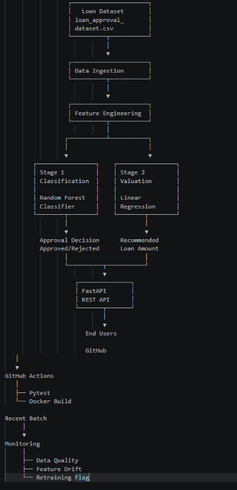
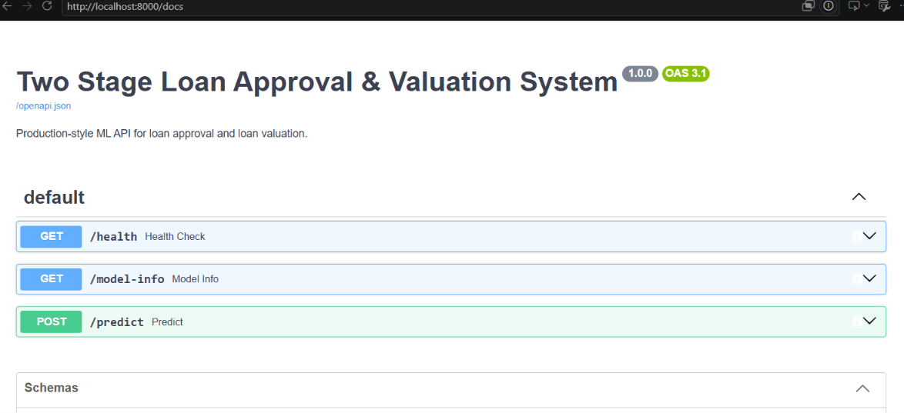
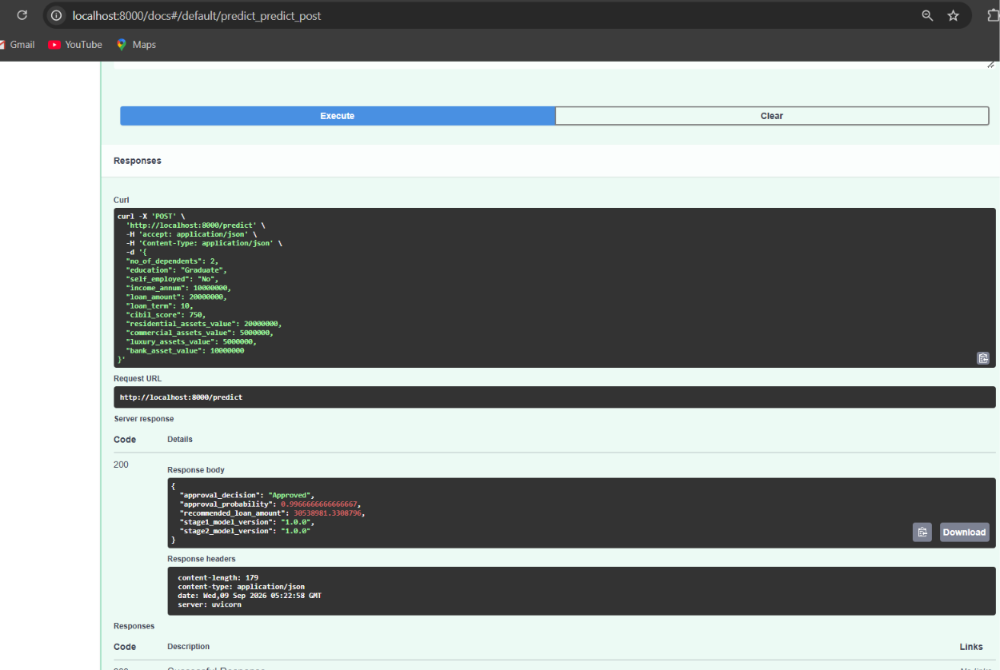
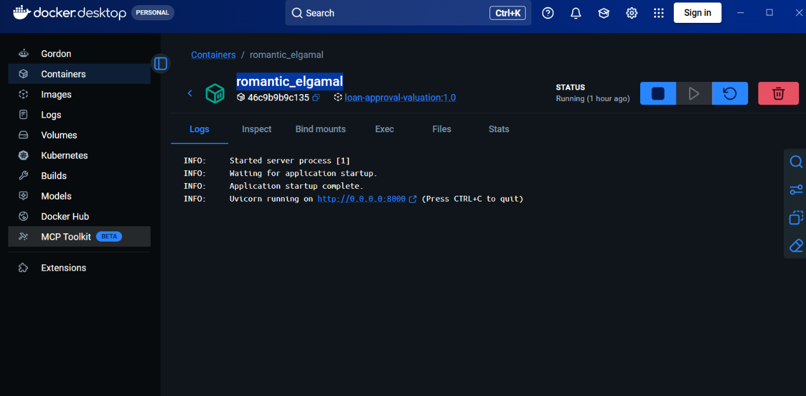
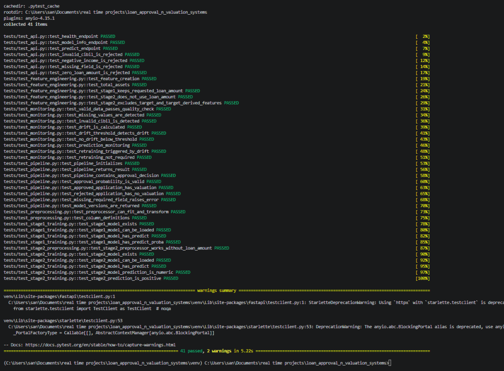
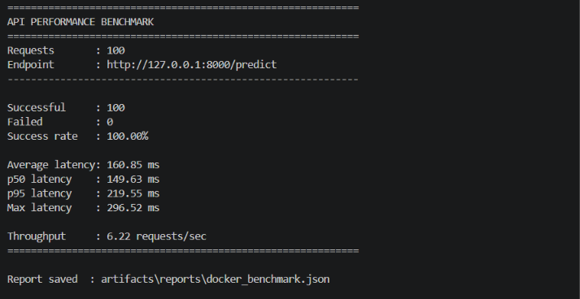
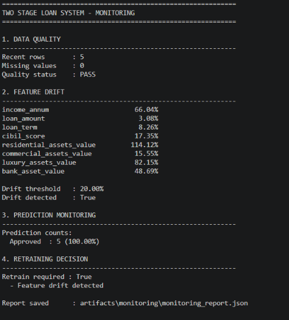

# 🏦 Two Stage Loan Approval & Valuation System


An end-to-end **MLOps-based Two Stage Loan Approval & Valuation System** that combines machine learning, feature engineering, FastAPI serving, Docker deployment, automated testing, monitoring, drift detection, batch inference, and GitHub Actions CI.

---

## 📌 Project Overview

The **Two Stage Loan Approval & Valuation System** is designed to automate two important parts of a loan decision workflow.

### Stage 1 — Loan Approval

A classification model determines whether a loan application should be:

- ✅ Approved
- ❌ Rejected

The selected model is:

**RandomForestClassifier**

### Stage 2 — Loan Valuation

For approved applications, a regression model estimates a:

**Recommended Loan Amount**

The selected model is:

**LinearRegression**

The complete workflow is:

```text
Loan Application
       │
       ▼
Data Validation
       │
       ▼
Feature Engineering
       │
       ▼
Preprocessing
       │
       ▼
┌─────────────────────────────┐
│ Stage 1: Approval           │
│ RandomForestClassifier      │
└──────────────┬──────────────┘
               │
        ┌──────┴──────┐
        │             │
     Approved       Rejected
        │             │
        ▼             ▼
┌────────────────┐   Stop
│ Stage 2:       │
│ Valuation      │
│ LinearRegression│
└───────┬────────┘
        │
        ▼
Recommended Loan Amount
        │
        ▼
      FastAPI
        │
        ▼
      End User
```

---

# 🎯 Objectives

The major objectives of this project are:

- Automate initial loan approval classification.
- Estimate a recommended loan amount for approved applications.
- Build a reusable machine learning pipeline.
- Provide real-time predictions through a REST API.
- Containerize the application using Docker.
- Implement automated testing using pytest.
- Implement batch inference.
- Monitor data quality and feature drift.
- Generate model evaluation and monitoring reports.
- Implement continuous integration using GitHub Actions.
- Provide a reproducible MLOps architecture.

---

# 🏗️ System Architecture



The system consists of the following major components:

1. Data Source
2. Data Ingestion
3. Feature Engineering
4. Preprocessing
5. Stage 1 — Approval Classification
6. Stage 2 — Loan Valuation
7. FastAPI Model Serving
8. Monitoring & Drift Detection
9. Model Artifacts
10. GitHub Actions CI
11. Docker Deployment
12. Project Configuration

---

# 📊 Dataset

The project uses:

```text
loan_approval_dataset.csv
```

### Dataset size

| Property | Value |
|---|---:|
| Rows | 4,269 |
| Columns | 13 |
| Missing values | 0 |
| Duplicate rows | 0 |

### Main features

| Feature | Description |
|---|---|
| `no_of_dependents` | Number of dependents |
| `education` | Education level |
| `self_employed` | Employment status |
| `income_annum` | Annual income |
| `loan_amount` | Requested loan amount |
| `loan_term` | Loan term |
| `cibil_score` | CIBIL credit score |
| `residential_assets_value` | Residential assets |
| `commercial_assets_value` | Commercial assets |
| `luxury_assets_value` | Luxury assets |
| `bank_asset_value` | Bank assets |
| `loan_status` | Approval target |

`loan_id` is treated as an identifier and is not used as a predictive feature.

---

# ⚙️ Feature Engineering

The system generates additional features to improve model representation.

### Engineered features

```text
total_assets
loan_to_income_ratio
assets_to_income_ratio
income_per_dependent
requested_loan_per_term
bank_asset_ratio
luxury_asset_ratio
asset_coverage_ratio
cibil_band
```

### CIBIL bands

| CIBIL Score | Band |
|---:|---|
| ≤ 549 | Poor |
| 550–649 | Fair |
| 650–749 | Good |
| ≥ 750 | Excellent |

Categorical variables are encoded using one-hot encoding.

Numerical features are processed using the project's preprocessing pipeline.

---

# 🤖 Stage 1 — Loan Approval Classification

### Objective

Predict whether a loan application should be approved or rejected.

### Model

```text
RandomForestClassifier
```

### Target

```text
loan_status
```

### Output

```text
Approved
Rejected
```

### Evaluation metrics

- Accuracy
- Precision
- Recall
- F1-score
- ROC-AUC

### Current evaluation

| Metric | Score |
|---|---:|
| Accuracy | 1.0000 |
| Precision | 1.0000 |
| Recall | 1.0000 |
| F1-score | 1.0000 |
| ROC-AUC | 1.0000 |

The Stage 1 model is stored as:

```text
artifacts/models/stage1_approval_model.joblib
```

> ⚠️ The near-perfect classification results should be interpreted cautiously. The supplied dataset may contain highly deterministic relationships, so additional validation on representative real-world data would be required before production use.

---

# 💰 Stage 2 — Loan Valuation

Stage 2 runs only when the Stage 1 decision is:

```text
Approved
```

### Objective

Estimate a recommended loan amount.

### Selected model

```text
LinearRegression
```

### Target

```text
loan_amount
```

### Model comparison

| Model | MAE | RMSE | R² |
|---|---:|---:|---:|
| Linear Regression | ~2.63M | ~3.45M | ~0.851 |
| Random Forest Regression | ~2.61M | ~3.48M | ~0.849 |

Linear Regression was selected because the Random Forest candidate did not improve the overall promotion criteria.

Model artifact:

```text
artifacts/models/stage2_valuation_model.joblib
```

---

# 🔐 Target Leakage Prevention

Stage 2 does **not** use `loan_amount` as an input because it is the prediction target.

The following target-dependent features are also excluded:

```text
loan_amount
loan_to_income_ratio
requested_loan_per_term
asset_coverage_ratio
```

This prevents the regression model from indirectly receiving information derived from the value it is supposed to predict.

---

# 🚀 API Serving

The application uses **FastAPI** for model serving.

Application:

```text
src/serving/app.py
```

### Endpoints

| Endpoint | Method | Purpose |
|---|---|---|
| `/health` | GET | Service health |
| `/model-info` | GET | Model information |
| `/predict` | POST | Loan prediction |

### Swagger UI

After starting the API:

```text
http://localhost:8000/docs
```

---

# 🧪 Example Prediction

### Request

```json
{
  "no_of_dependents": 2,
  "education": "Graduate",
  "self_employed": "No",
  "income_annum": 10000000,
  "loan_amount": 20000000,
  "loan_term": 10,
  "cibil_score": 750,
  "residential_assets_value": 20000000,
  "commercial_assets_value": 5000000,
  "luxury_assets_value": 5000000,
  "bank_asset_value": 10000000
}
```

### Response

```json
{
  "approval_decision": "Approved",
  "approval_probability": 0.9966666666666667,
  "recommended_loan_amount": 30538981.3308796,
  "stage1_model_version": "1.0.0",
  "stage2_model_version": "1.0.0"
}
```

---

# 🐳 Docker Deployment

The application is containerized using Docker.

### Build image

```bash
docker build -t loan-approval-valuation:1.0 .
```

### Run container

```bash
docker run -p 8000:8000 loan-approval-valuation:1.0
```

The API will then be available at:

```text
http://localhost:8000
```

Swagger:

```text
http://localhost:8000/docs
```

Docker provides a reproducible environment containing:

```text
Python
Dependencies
Source Code
Trained Models
Configuration
FastAPI
Uvicorn
```

---

# 🧪 Testing

The project uses **pytest** for automated testing.

The test suite covers:

- API
- Data ingestion
- Preprocessing
- Training
- Monitoring
- Drift detection

Latest test result:

```text
41 passed
2 warnings
```

Run locally:

```bash
pytest -v
```

---

# 📦 Batch Inference

The project supports batch prediction.

### Input

```text
data/recent_batch/sample_applications.csv
```

### Command

```bash
python -m src.utils.batch_inference \
  --input data/recent_batch/sample_applications.csv \
  --output data/recent_batch/predictions.csv
```

Latest batch test:

```text
Input rows: 5
Predictions: 5
Status: SUCCESS
```

---

# 📈 Performance Benchmark

The Dockerized API was benchmarked using 100 requests.

| Metric | Result |
|---|---:|
| Total requests | 100 |
| Successful requests | 100 |
| Failed requests | 0 |
| Success rate | 100% |
| Average latency | 160.85 ms |
| P50 latency | 149.63 ms |
| P95 latency | 219.55 ms |
| Maximum latency | 296.52 ms |
| Throughput | 6.22 requests/sec |

Benchmark report:

```text
artifacts/reports/docker_benchmark.json
```

---

# 🔍 Monitoring & Drift Detection

The system includes monitoring for recent application batches.

### Monitoring checks

- Data quality
- Missing values
- Feature distribution
- Feature drift
- Prediction distribution
- Retraining requirement

The current drift threshold is:

```text
20%
```

If significant drift is detected:

```text
Feature Drift
     │
     ▼
Drift Detected
     │
     ▼
Retraining Required
```

Monitoring report:

```text
artifacts/monitoring/monitoring_report.json
```

The latest monitoring run detected feature drift and flagged retraining as required.

---

# ⚙️ Configuration

Project configuration is maintained in:

```text
configs/config.yaml
```

Configuration includes:

- Project information
- Data paths
- Artifact paths
- Model settings
- Model versions
- Monitoring thresholds
- API configuration

This keeps operational configuration separate from application code.

---

# 🔄 CI Pipeline

GitHub Actions is used for continuous integration.

Workflow:

```text
.github/workflows/main.yml
```

### CI process

```text
Push to GitHub
      │
      ▼
Checkout Repository
      │
      ▼
Setup Python 3.11
      │
      ▼
Install Dependencies
      │
      ▼
Run Pytest
      │
      ▼
Build Docker Image
      │
      ▼
Verify Docker Image
      │
      ▼
CI SUCCESS
```

Current pipeline status:

```text
Python Tests       ✅
Docker Build       ✅
Docker Verification ✅
CI Summary         ✅
```

The workflow runs automatically on pushes to `main` and pull requests targeting `main`.

---

# 📁 Project Structure

```text
loan_approval_n_valuation_systems/
│
├── .github/
│   └── workflows/
│       └── main.yml
│
├── artifacts/
│   ├── logs/
│   ├── models/
│   │   ├── stage1_approval_model.joblib
│   │   └── stage2_valuation_model.joblib
│   ├── reports/
│   │   ├── stage1_evaluation.json
│   │   ├── stage2_evaluation.json
│   │   └── docker_benchmark.json
│   └── monitoring/
│
├── configs/
│   └── config.yaml
│
├── data/
│   ├── raw/
│   ├── processed/
│   └── recent_batch/
│
├── docs/
│   ├── design_document.md
│   └── images/
│       ├── architecture.png
│       ├── api_performance.png
│       ├── benchmark_results.png
│       ├── docker_prediction_response.png
│       ├── monitoring_report.png
│       ├── prediction_response.png
│       ├── project_structure.png
│       ├── pytest_results.png
│       └── swagger_ui.png
│
├── notebooks/
│
├── src/
│   ├── feature_engineering/
│   ├── ingestion/
│   ├── monitoring/
│   ├── pipeline/
│   ├── preprocessing/
│   ├── serving/
│   ├── training/
│   └── utils/
│
├── tests/
│
├── .dockerignore
├── .gitignore
├── Dockerfile
├── README.md
└── requirements.txt
```

---

# 🛠️ Technology Stack

| Technology | Purpose |
|---|---|
| Python 3.11 | Application & ML development |
| Pandas | Data processing |
| NumPy | Numerical operations |
| Scikit-learn | Machine learning |
| FastAPI | REST API |
| Pydantic | Request validation |
| Uvicorn | API server |
| Joblib | Model persistence |
| Pytest | Automated testing |
| Docker | Containerization |
| Git | Version control |
| GitHub | Source repository |
| GitHub Actions | Continuous integration |
| YAML | Configuration |

---

# 📊 MLOps Components

This project demonstrates the following MLOps practices:

### Data

```text
Data ingestion
Data validation
Feature engineering
Preprocessing
```

### Model

```text
Training
Evaluation
Model comparison
Model persistence
Model versioning
```

### Serving

```text
FastAPI
REST endpoints
Swagger UI
Input validation
```

### Deployment

```text
Docker
Reproducible environment
Containerized API
```

### Monitoring

```text
Data quality
Feature drift
Prediction monitoring
Retraining recommendation
```

### Automation

```text
Pytest
GitHub Actions
Docker build verification
```

---

# ⚠️ Limitations

This project is an academic/portfolio-oriented MLOps implementation and has several limitations:

1. The dataset contains only 4,269 records.
2. Stage 1 achieves near-perfect evaluation results, which require additional validation on representative real-world data.
3. The monitoring system uses a lightweight drift detection approach.
4. Retraining is currently recommended rather than fully automated.
5. No production database or feature store is currently implemented.
6. Enterprise authentication and authorization are not implemented.
7. Human underwriting workflows are outside the current scope.
8. The current deployment is container-based but not yet cloud-native.

---

# 🔮 Future Enhancements

Potential improvements include:

- MLflow experiment tracking
- Model registry
- Automated retraining
- Automated model approval
- Cloud deployment using AWS, Azure, or GCP
- Kubernetes deployment
- Feature store integration
- Database integration
- Advanced drift detection
- Model explainability using SHAP
- Authentication and authorization
- Role-based access control
- Real-time monitoring dashboards
- Human-in-the-loop approval
- Automated production deployment

---

# 🎓 Academic / Demonstration Value

This project demonstrates knowledge of:

```text
Machine Learning
      +
Software Engineering
      +
API Development
      +
Docker
      +
Testing
      +
Monitoring
      +
CI/CD
      +
MLOps
```

It can be presented as an example of how a machine learning model can be transformed from a notebook-based experiment into a structured, testable, deployable and monitored application.

---

# 👥 Intended Users

Potential users include:

- Bank loan officers
- Financial institutions
- Credit analysts
- Loan processing teams
- Authorized internal applications

The system is intended to support decision-making and should be integrated with appropriate institutional policies, validation procedures and human oversight before real-world financial use.

---

# 📷 Project Screenshots

### Architecture


### Swagger UI



### Prediction Response



### Docker Prediction



### Pytest Results



### Performance Benchmark



### Monitoring



---

# 👩‍💻 Author

**Swapna Jyoti**

GitHub:

`https://github.com/swapna00725`

Repository:

`https://github.com/swapna00725/two-stage-loan-approval-valuation-system`

---

# 📄 License

This project is intended for academic, educational and demonstration purposes.